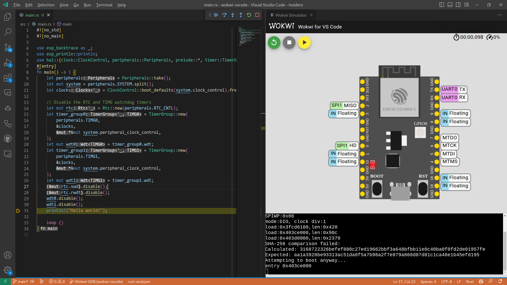

# Wokwi

[Wokwi][wokwi]是一个在线模拟器，支持在 Espressif 芯片上模拟 Rust 项目（包括`std`和`no_std`）。
请参考[wokwi.com/rust][wokwi-rust]以获取示例列表和开始新项目的方法。

Wokwi 提供了 Wi-Fi 仿真、虚拟逻辑分析仪和[GDB 调试][gdb-debugging]等许多功能，请参考[Wokwi 文档][wokwi-documentation]以获取更多详细信息。
对于 ESP 芯片，有一个[仿真功能][wokwi-simulation-features]表格，列出了当前支持的功能。

[wokwi]: https://wokwi.com/
[wokwi-rust]: https://wokwi.com/rust
[gdb-debugging]: https://docs.wokwi.com/zh-CN/gdb-debugging
[wokwi-documentation]: https://docs.wokwi.com/zh-CN/
[wokwi-simulation-features]: https://docs.wokwi.com/zh-CN/guides/esp32#simulation-features

## 使用 Wokwi VS Code 扩展
Wokwi 提供了一个 VS Code 扩展，允许通过添加几个文件直接在代码编辑器中模拟项目。
更多信息，请参考[Wokwi 文档][wokwi-vscode]。
还可以使用 VS Code 调试器调试代码，请参考[调试你的代码][wokwi-debugging]。

当使用任何[模板][templates]并且不使用默认值时，会有一个提示(`Configure project to support Wokwi simulation with Wokwi VS Code extension?`)，生成所需的文件以使用 Wokwi VS Code 扩展。

[wokwi-vscode]: https://docs.wokwi.com/zh-CN/vscode/getting-started
[wokwi-debugging]: https://docs.wokwi.com/zh-CN/vscode/debugging
[templates]: ./../../writing-your-own-application/generate-project/index.md

## 使用`wokwi-server`

[`wokwi-server`][wokwi-server]是一个 CLI 工具，用于启动项目的 Wokwi 仿真。也就是说，它允许在本地或容器中构建项目，并模拟生成的二进制文件。

[`wokwi-server`][wokwi-server]还允许在其他 Wokwi 项目上模拟二进制文件，除了芯片本身外还有更多的硬件部件。请参考[`wokwi-server README` 的相应部分][wokwi-server-custom] 以获取详细说明。

[wokwi-server]: https://github.com/MabezDev/wokwi-server
[wokwi-server-custom]: https://github.com/MabezDev/wokwi-server#simulating-your-binary-on-a-custom-wokwi-project

## 自定义芯片

Wokwi 允许生成自定义芯片，让你对 Wokwi 不支持的组件的行为进行编程。更多详情，请参考官方[Wokwi 文档][wokwi-custom-chip]。

自定义芯片也可以用 Rust 编写！请参考[Wokwi Custom Chip API][rust-chip-api]以获取更多信息。例如，使用 Rust 编写的自定义[反相器芯片][custom-chip-example]。

[wokwi-custom-chip]: https://docs.wokwi.com/chips-api/getting-started
[rust-chip-api]: https://github.com/wokwi/wokwi_chip_ll
[custom-chip-example]: https://github.com/wokwi/rust_chip_inverter
